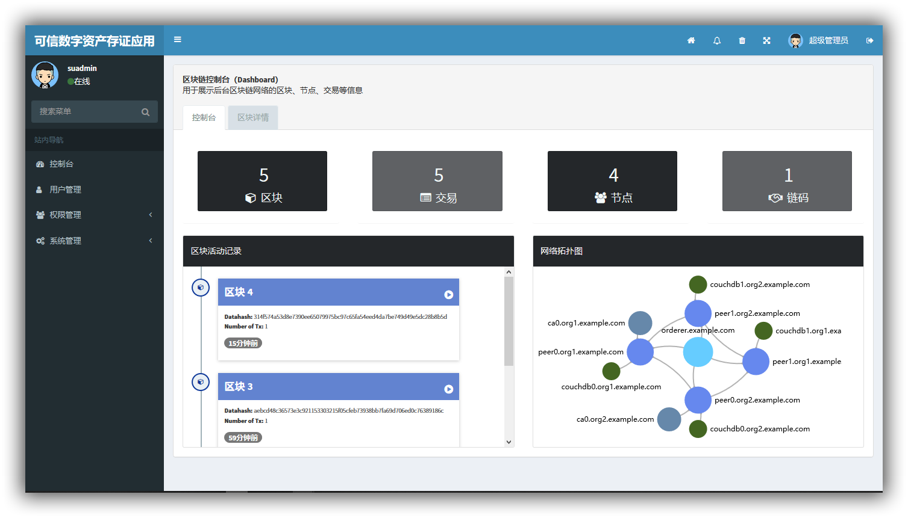

# <div align="center"></div>

<p align="center">«Sada» 是第七届中国软件杯赛题 <a href="http://www.cnsoftbei.com/bencandy.php?fid=151&aid=1613">可信数字资产存储应用</a> 的参赛作品</p>

<p align="center">由石家庄铁道大学 Genesis-Block 团队开发并维护</p>

<p align="center">
  <a href="https://www.codacy.com/app/dmego/Sada?utm_source=github.com&amp;utm_medium=referral&amp;utm_content=dmego/Sada&amp;utm_campaign=Badge_Grade"></a>
  <a href="https://github.com/dmego/Sada/tree/V1.0"></a>
  <a href="https://github.com/dmego/Sada/tree/V1.0/LICENSE.md"></a>
  <a href="https://saythanks.io/to/dmego"></a>
</p>

## 项目简介

>可信数字资产存证应用是在云计算平台分配的虚拟机部署存证应用的区块链网络， 存证应用可将数字资产（PDF文档、图片、视频等）中关键信息（包括但不限于中、英文等语言） 及数字资产的md5值保存到区块链，同时将数字资产保存到存储服务器。它可以有效地对数字资产 的关键信息进行保存，防止信息被篡改；同时,由于应用底层使用区块链技术，具备良好的容灾备份机制，从而可有效的防止单点故障。

>本项目是一款基于 [HyperLedger Fabric](https://github.com/hyperledger/fabric) 的区块链应用，想要了解更多项目内容，请见大赛官网上的 [题目介绍](http://www.cnsoftbei.com/bencandy.php?fid=151&aid=1613)

## 目录说明

```
Sada
  ├─ Document[...]                        //项目相关说明文档
  ├─ FabricConfig[...]                    //区块链网络配置文件
  ├─ SadaCode[...]                        //项目主体程序源码
  ├─ TestData[...]                        //测试数据
  ├─ sadaApi[...]                         //Fabric-java-SDK交互接口源码
  ├─ LICENSE                              //开源协议
  ├─ README.md                            //README文件
  └─ ...
```

## 开发环境

```
myEclipse or Eclipse
JDK 1.8
Tomcat 8.0
HyperLedger Fabric 1.0

project 编码 UTF-8
workplace 编码 UTF-8
```

## 项目截图

- 登录注册页面



- MD5值比对页面


- 区块链控制台


## 项目说明

- 这是初赛时提交的作品，版本号为 v1.0
- 具体的项目配置说明请参考说明文档